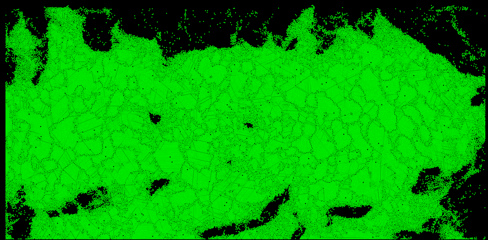
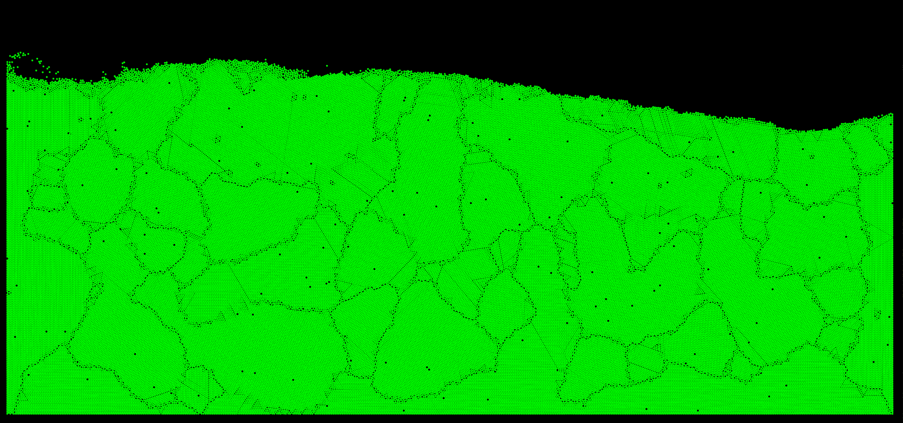
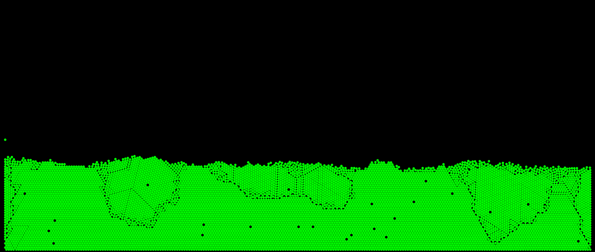

# Collision Engine

To run, run the corresponding executable. Example, for 100 thousand particles, run teh executable `100k`

Simulation of a 100k particles

It works by dividing the space into a grid. The position of each particle is reccorded into the grid. Now, when a particle has to check if it's collising with another, it simply has to calculate it's current grid id in x and y component. Once it does that, it then just has to look at the particles in teh adjacent grid cells.
If there was no grid, the particle would have to check with every other particle to make sure none of them collided, which would be very inefficient.

10K particles
